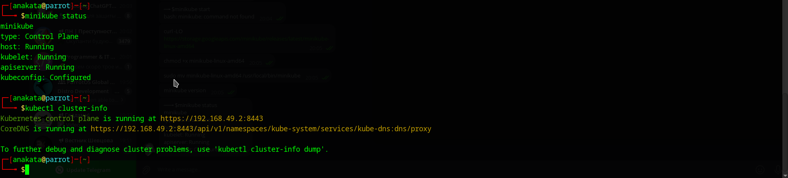
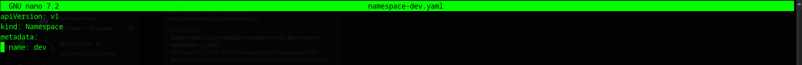
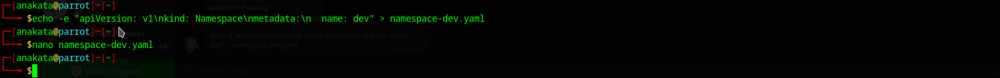
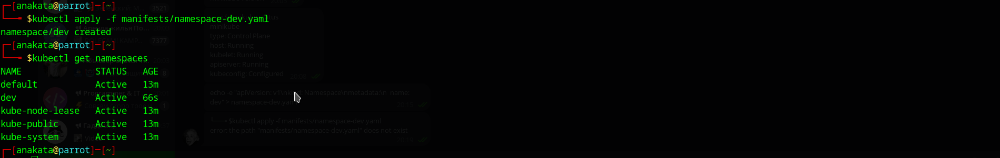
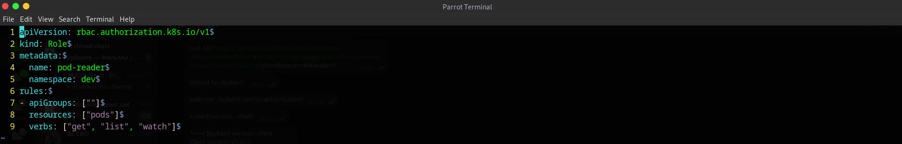
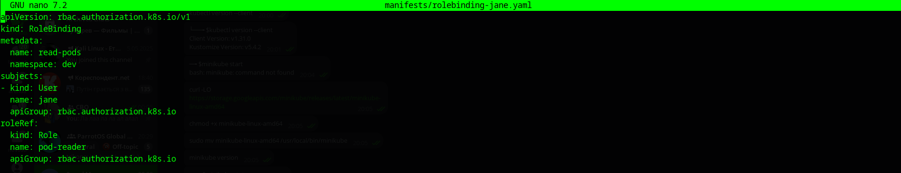
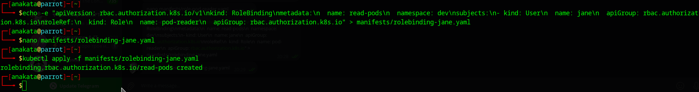
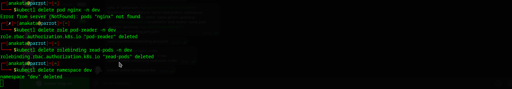

# Kubernetes – Namespaces & RBAC (Light) – Self-Guided Labs

📅 **Date:** 27/05/2025 & 03/06/2025  

📦 **Topic:** Kubernetes Namespaces & Role-Based Access Control (RBAC)

👤 **Author:** Staroshchuk Kirill (anakata), StudentID: 29933

👤 **Professor:** Piotr Sroczyński

---

## Part 1: Why Namespaces?

Namespaces help organize your Kubernetes cluster into logical environments like:

- `dev`
- `test`
- `prod`

They provide:
- Resource isolation
- Quota management
- Separation between teams/projects

---

## Step 1: Start a Local Kubernetes Cluster
 Start the local Kubernetes cluster using Minikube:
    
```bash
minikube start
```
Check the status:
```bash
minikube status

kubectl cluster-info
```
 

## Step 2: Create a Namespace
Create a YAML file: manifests/namespace-dev.yaml


```bash
apiVersion: v1
kind: Namespace
metadata:
  name: dev
```
Apply the file:
```bash
kubectl apply -f manifests/namespace-dev.yaml
```
Ensure that the namespace was created:
```bash
kubectl get namespaces
```
 

 

 

## Step 3: Deploy a Simple Application in the dev Namespace
```bash
kubectl run nginx --image=nginx --port=80 --namespace=dev
```
Ensure the pod is running:
```bash
kubectl get pods -n dev
```

## Step 4: Set Up RBAC
4.1 Create a Role

file: manifests/role-pod-reader.yaml
```bash
apiVersion: rbac.authorization.k8s.io/v1
kind: Role
metadata:
  namespace: dev
  name: pod-reader
rules:
- apiGroups: [""]
  resources: ["pods"]
  verbs: ["get", "watch", "list"]
```
Apply the role:
```bash
kubectl apply -f manifests/role-pod-reader.yaml
```
 

4.2 Create a RoleBinding

file: manifests/rolebinding-jane.yaml
```bash
apiVersion: rbac.authorization.k8s.io/v1
kind: RoleBinding
metadata:
  name: read-pods
  namespace: dev
subjects:
- kind: User
  name: jane
  apiGroup: rbac.authorization.k8s.io
roleRef:
  kind: Role
  name: pod-reader
  apiGroup: rbac.authorization.k8s.io
```
 

Apply the RoleBinding:
```bash
kubectl apply -f manifests/rolebinding-jane.yaml
```
 

## Step 5: Clean Up the Cluster

Delete the application and roles:
```bash
kubectl delete pod nginx -n dev
kubectl delete role pod-reader -n dev
kubectl delete rolebinding read-pods -n dev
```
Delete the namespace:
```bash
kubectl delete namespace dev
```
 
